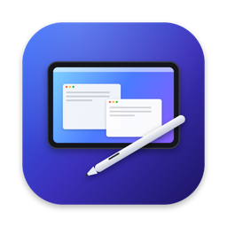
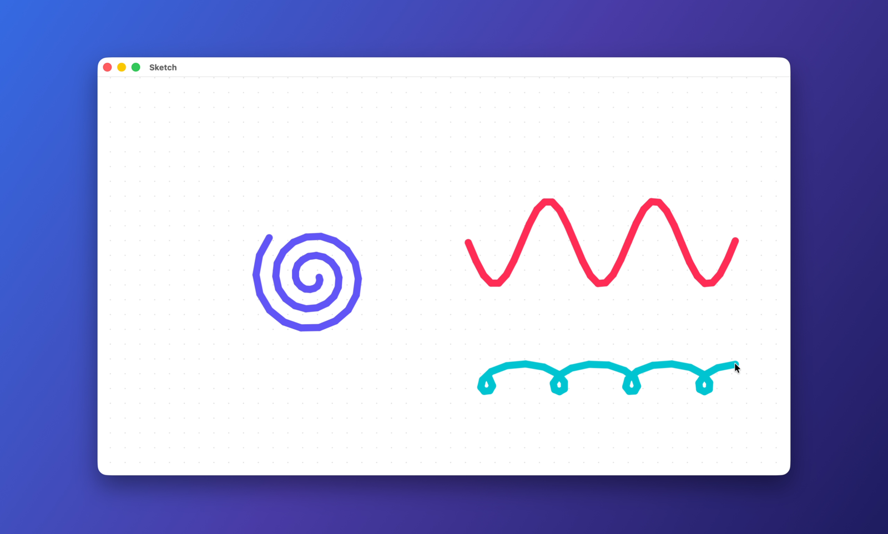
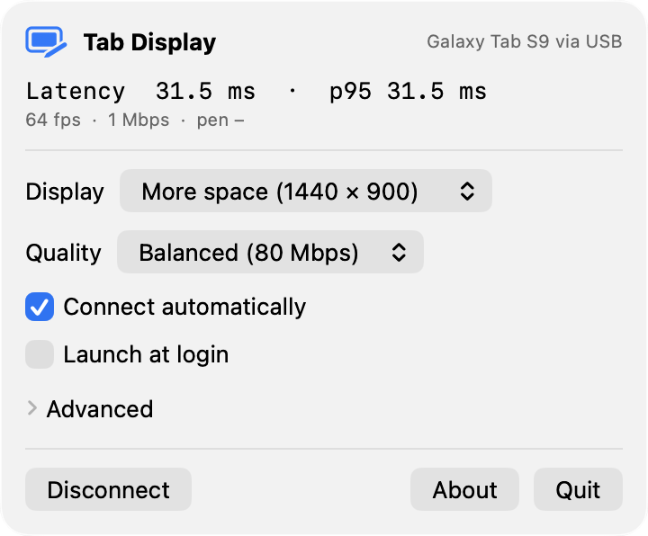
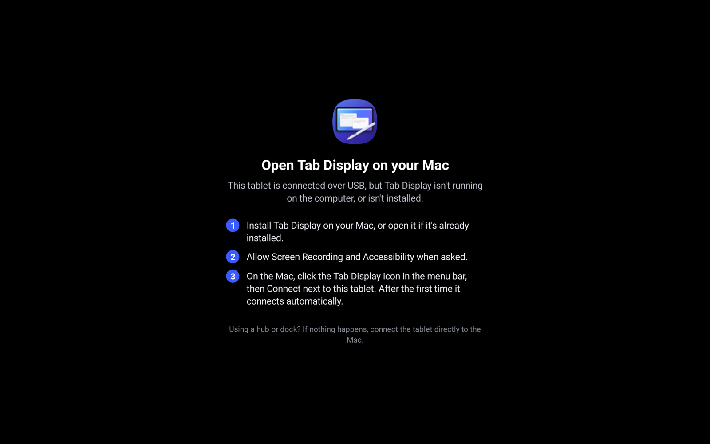

<p align="center">
  
</p>

<h1 align="center">Tab Display</h1>

<p align="center">
  Use an Android tablet as a wired, low-latency second display for your Mac, with pen and touch.
</p>

<p align="center">
  
  
  
</p>

<p align="center">
  <a href="https://github.com/AlexKGwyn/tab-display/releases/latest"></a>
  <br>
  <sub><a href="https://github.com/AlexKGwyn/tab-display/releases/latest">Download the Mac app (DMG) and tablet app (APK)</a> · <a href="#getting-started">Getting started</a></sub>
</p>

<p align="center">
  
</p>

Tab Display is a Sidecar-style extended display for Android tablets. A menu bar app on the Mac creates
a virtual display, streams it over a USB cable with hardware HEVC encoding, and the tablet decodes it in
hardware and shows it pixel-for-pixel. Stylus and touch input go back over the same cable.

## Features

- **Extended desktop over USB.** No Wi‑Fi and no developer mode. Plug in, and the tablet becomes a second display.
- **Retina sharp.** HiDPI at the tablet's native resolution (Sharpest is exact 2×, or choose More/Most space).
  Text is sharpened when the screen goes idle.
- **Stylus with pressure and tilt.** Hover moves the pointer, and the side button right-clicks. It works in pressure-aware apps.
- **Touch.** One- and two-finger scrolling with momentum, tap to click, two-finger tap to right-click.
- **Any orientation.** Rotate the tablet and the Mac's display reshapes in place. Split-screen works too.
- **Hardware all the way.** ScreenCaptureKit → VideoToolbox HEVC → USB → MediaCodec, with no CPU pixel copies.
  About 26 ms average from the Mac compositing a frame to it reaching the tablet's screen ([details](docs/RESULTS.md)).
- **Installs its own tablet app.** The Mac app bundles the Android app and can install or update it over USB.
- **Not tied to one tablet.** The tablet reports its resolution, size, refresh rate and decoders, and the
  Mac adapts. Developed on a Galaxy Tab S9.

<table>
  <tr>
    <td align="center" width="45%"><br><sub>The Mac menu: status, live latency, display size, quality</sub></td>
    <td align="center"><br><sub>The tablet explains what to do when it isn't connected</sub></td>
  </tr>
</table>

## Getting started

**Requirements:** a Mac with Apple silicon on macOS 14 or later; an Android 14+ tablet with a hardware
HEVC or H.264 decoder; a USB‑C cable that carries data.

1. Download `TabDisplay-<version>.dmg` from the [latest release](https://github.com/AlexKGwyn/tab-display/releases/latest)
   and drag **Tab Display** to Applications. The first time, macOS blocks it because the build isn't
   notarized yet: open **System Settings › Privacy & Security** and click **Open Anyway**.
2. Grant **Screen Recording** and **Accessibility** when asked, then quit and reopen Tab Display.
3. Install the tablet app, either:
   - from the Mac: turn on USB debugging on the tablet, plug it in, open the Tab Display menu and click
     **Install**; or
   - by sideloading `TabDisplay-<version>.apk` from the same release onto the tablet.
4. Plug the tablet in, then click **Connect** next to it in the menu. On the tablet, tick "Always open Tab
   Display" and tap OK. From then on it connects automatically whenever you plug it in.

On the tablet, a three-finger tap toggles a latency HUD. The Mac menu's **Advanced** section has the
refresh rate, idle text sharpening and a live latency chart with CSV export.

macOS shows its purple screen-recording indicator while the tablet is connected, because Tab Display
captures its virtual display with ScreenCaptureKit.

## How it works

```
Mac                                                      Tablet
CGVirtualDisplay → ScreenCaptureKit (NV12, GPU) ──┐
                   VideoToolbox HEVC (hardware) ──┤  USB (Android Open Accessory, ~80 MB/s)
                                                  └──────────────► MediaCodec (hardware) → SurfaceView
CGEvent tablet/mouse/scroll injection ◄──────────────────────────── stylus & touch (unbuffered)
```

- **Virtual display:** the private `CGVirtualDisplay` API (as used by [DeskPad](https://github.com/Stengo/DeskPad)),
  in HiDPI modes derived from the tablet's panel.
- **Transport:** Android Open Accessory over USB bulk endpoints, through a small framed protocol
  ([`protocol/spec.md`](protocol/spec.md)). It reconnects on replug, sleep/wake and app restarts.
- **Latency:** the stream never queues. While the encoder is busy, only the newest frame is kept, and
  the tablet presents each frame the moment it's decoded. Every stage is timestamped on a shared
  clock (shown in the HUD and the latency window).

Measurements on an M3 MacBook Air with a Galaxy Tab S9, design decisions and experiments are in
[`docs/RESULTS.md`](docs/RESULTS.md).

## Building

```sh
cd mac && ./build.sh --install     # builds and bundles the Android app, then installs Tab Display.app
```

Needs the Xcode Command Line Tools, the Android SDK (platform 36, NDK 26.1) and JDK 17. See
[`docs/DEVELOPMENT.md`](docs/DEVELOPMENT.md) for the full build, signing and notarization, Play
publishing, and the test and measurement tools.

## Privacy

No accounts, no analytics, no internet access: everything stays on the USB cable between your Mac and
your tablet. See [`PRIVACY.md`](PRIVACY.md).

## Acknowledgements

- [libusb](https://libusb.info) (LGPL-2.1), bundled as a replaceable dynamic library.
- [DeskPad](https://github.com/Stengo/DeskPad) (MIT) for documenting the `CGVirtualDisplay` API.
- The AOSP [adb protocol](https://android.googlesource.com/platform/packages/modules/adb/+/refs/heads/main/protocol.txt)
  and [Android Open Accessory](https://source.android.com/docs/core/interaction/accessories/protocol) documentation.
